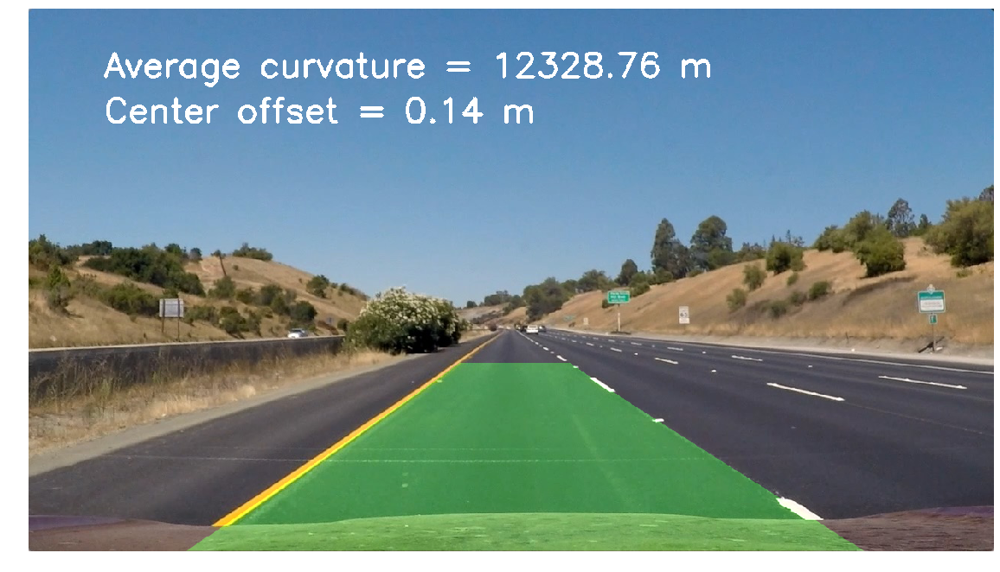

# Self Drivng Car - Project 2:  Advanced Lane Finding

The goal of the project is to write a software pipeline to identify the lane boundaries in a video. 

The Project Outline
---

The goals / steps of this project are the following:

* Compute the camera calibration matrix and distortion coefficients given a set of chessboard images.
* Apply a distortion correction to raw images.
* Use color transforms, gradients, etc., to create a thresholded binary image.
* Apply a perspective transform to rectify binary image ("birds-eye view").
* Detect lane pixels and fit to find the lane boundary.
* Determine the curvature of the lane and vehicle position with respect to center.
* Warp the detected lane boundaries back onto the original image.
* Output visual display of the lane boundaries and numerical estimation of lane curvature and vehicle position.

### Python code cant be found here: 
https://github.com/shinyingl/SelfDrivingCar-P2/blob/master/Project2-Advanced-Lane-Lines.ipynb

### 1. Camera Calibration
---
The camera calibration code is in `def CameraCal(images)`. Images of chessboard pattern captured at different angles is used to calibrate the abberations from the camera optical system. The undistorted pattern after calibration is shown as the below images.

### 2. Thresholded Binary Image
---
- Color Transform (`def color_thresh`): The images are converted into HLS color space. L channel and S channel are both used. I found limiting L channel change help to stablize the lane line color binary output under tree shadows. 
- Grandient Transform (`def abs_sobel_thresh` & `def mag_thresh` & `def dir_threshold`): Consider Sobel gradient in horizonal/vertial, magnitude, line orientation. 
- A combinarion of the above transform were used for the binary image output is done in `def combin_thre`.

### 3. Perspective Transform (*birds-eye view*)
---
The "straight_line1.jpg" is used to obtain the tranformation matrix M and inverse of M in `def birdseye`. It is easier to eye-ball if the transformation is working as expecected. The lane lines from the image are transform into a birds-eye view that shows the two lane lines are in parrellel. I assume this part can potentially be done if we can measure the camera tilting angle from the camera hardware. 

### 4. Find Lane Line at T0
---
Search the first frame lane lin with `def find_lane_line`:
- Histogram: The initial search of the lane line starts by doing the histogram of bottom 1/3 of thresholded binary images. 
- Sliding Window: A reasonable size of window starts from the bottom of the image and slides all the way to the top of the image by recentering the window based on the non-zero pixels found in the window. The window size should be determined by the curvature of the T0 image used.
- Polynomial Fit: Use a 2nd order polynomial to fit the non-zero piexels found in the sliding windows, and draw the lane line boudary from the fitted curve in yellow lines. 

   

### 5. Find Lane Line from the Feedback of Previous Frame
Use previous frame information as initial conditions to search current frame lane line with `search_around_poly`:
- From the 2nd frame of the video, use the previous fram fitted coefficient as a starting point to search for the non-zero pixels in the green shaded area as below. (I noticed that if I choose different search range in this compared to the sliding window range, it will screw up the lane line prediction a little bit with my chosen parameters of thresholded binary images.) 
- Again, a 2nd order polynominal fit is used to predict the lane line boundary. 
- Using the feedback from previous frame increases the stability of the lane line prediction

### 6. Determine the Curvature and Car Offset
Curvature radius is calculated in `def measure_curvature_real`, the car location with respect to image center is calculated in  `def car_offset`
- The pixel number coordinate is converted into physical unint in meters.
- The curvatures is calculated with the below eaqution: 
- The curvatures of both lanes are calculated from the curve in the bottom of the image. The output curvature is calculated by averaging the curvalture of both left lane line and right lane line.
- The car offset location is calculated by the average of left lane line and right lane line x-location subtracted by the image mid-point in x-direction.

  

### 7. Final Pipeline & Output in Static Image
By putting all the above together, a final image processing pipline is as show below:

Test the pipeline on static frames (that I had trouble with in the first view versions of pipleline)

  

### 8. Project Output Video
- Project Videio Link: https://github.com/shinyingl/SelfDrivingCar-P2/blob/master/project_video_out_final.mp4

### 9. Challenge
I tried the same pipline on the harder challenge videio. However, it is not very successful. So the video is not uploaded. 
- Below is the first frame result, it indicates that further tuning on the threashold and sliding window search is needed. 
- My green shade marked lane completely disappered after some light glare comes into the videio. It might be able to be improved if I input more previous frame data into the image processing pipeline if the current frame lane line is not found. 
- I do just notice here are some more suggesions at the end of project rubric page. But I will stop here for now and add the link as my own note for future improvment. Link: https://review.udacity.com/#!/rubrics/1966/view

 

